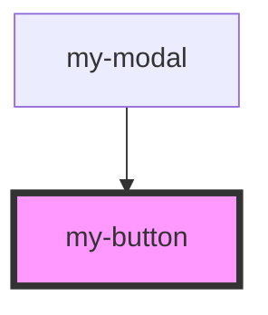

# my-button

<!-- Auto Generated Below -->

## Properties

| Property | Attribute | Description | Type                     | Default     |
| -------- | --------- | ----------- | ------------------------ | ----------- |
| `shape`  | `shape`   |             | `"rounded" \| "squared"` | `'squared'` |
| `type`   | `type`    |             | `"button" \| "submit"`   | `'submit'`  |

## Dependencies

### Used by

 - [my-modal](../my-modal)

### Graph

----------------------------------------------

*Built with [StencilJS](https://stenciljs.com/)*
