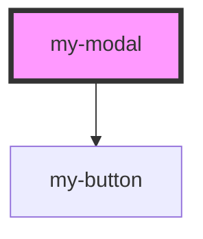

# my-modal

<!-- Auto Generated Below -->

## Properties

| Property     | Attribute     | Description | Type                            | Default    |
| ------------ | ------------- | ----------- | ------------------------------- | ---------- |
| `hAlign`     | `h-align`     |             | `"center" \| "left" \| "right"` | `'center'` |
| `hasOverlay` | `has-overlay` |             | `boolean`                       | `false`    |
| `isVisible`  | `is-visible`  |             | `boolean`                       | `false`    |
| `vAlign`     | `v-align`     |             | `"bottom" \| "center" \| "top"` | `'center'` |

## Dependencies

### Depends on

- [my-button](../my-button)

### Graph

----------------------------------------------

*Built with [StencilJS](https://stenciljs.com/)*
